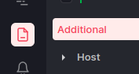

# Spring Example to set up for request body

---
## Middleware Logger

- Add dependency
  ```xml
  <!--  Dependency for middleware logger  -->
  <dependency>
      <groupId>io.github.middleware-labs</groupId>
      <artifactId>agent-apm-java</artifactId>
      <version>0.0.16</version>
  </dependency>
  ```
- Import Logger
  ```java
  import io.github.middlewarelabs.agentapmjava.Logger;
  ```
- Use request body as string
  - Example: 
    ```java
    package io.middleware.springdemo.controller;

    import io.github.middlewarelabs.agentapmjava.Logger;
    import io.middleware.springdemo.dto.RequestBodyExample;
    import org.springframework.web.bind.annotation.PostMapping;
    import org.springframework.web.bind.annotation.RequestBody;
    import org.springframework.web.bind.annotation.RestController;
    
    @RestController
    public class ExampleController {
        
        @PostMapping(value = "/post")
        public String postApi(@RequestBody RequestBodyExample requestBodyExample) {
            String requestBody = requestBodyExample.toString();
            Logger.debug(requestBody);
            return "Request body : %s".formatted(requestBody);
        }
    }
    ```

---

## Build and run  

- Clone the repository
  ```shell
  git clone https://github.com/middleware-labs/demo-apm.git
  cd demo-apm
  ```
- Navigate to the root directory of example project 
  ```shell
  cd java/spring-demo
  ```
- Build Jar file
  ```shell
  ./mvnw clean package  
  ```
- Add latest [middleware-javaagent.jar](https://install.middleware.io/jars/middleware-javaagent-1.1.0.jar) to root directory

- Run jar file with middleware-javaagent.jar
  ```shell
  java -javaagent:middleware-javaagent-{version}.jar \ 
    -Dotel.resource.attributes=project.name=spring-demo \
    -Dotel.service.name=spring-demo-service \
    -jar target/spring-demo-0.0.1-SNAPSHOT.jar
  ```
- Send a request
  ```shell
  curl -d '{"name": "john doe", "id": 1}' -H 'Content-Type: application/json' -X POST http://localhost:8080/post
  ```
- Navigate to the `Logs` tab \
  

- Observe the result in `List` tab\
  
  